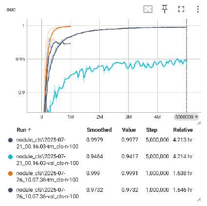
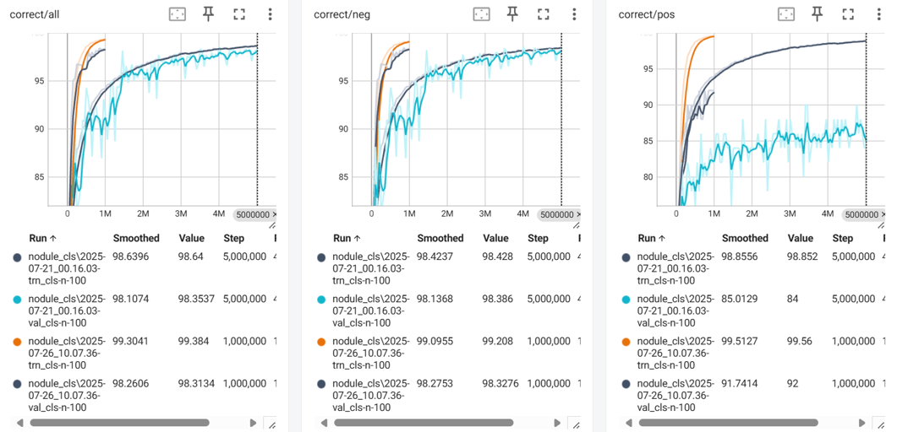
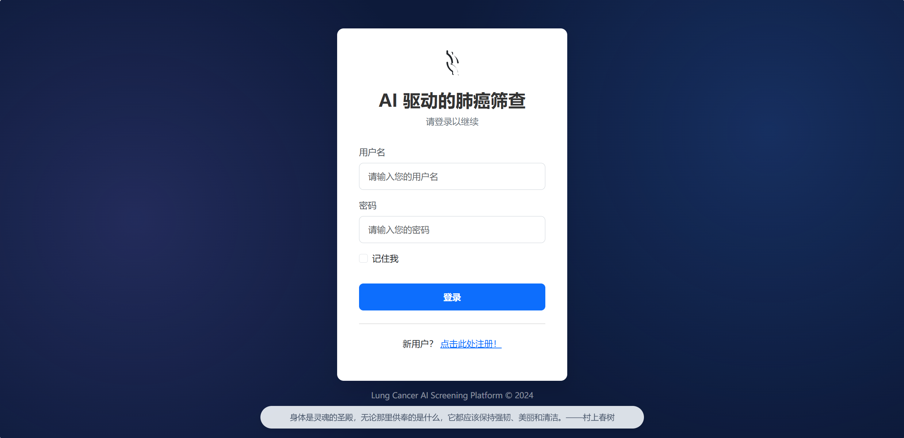
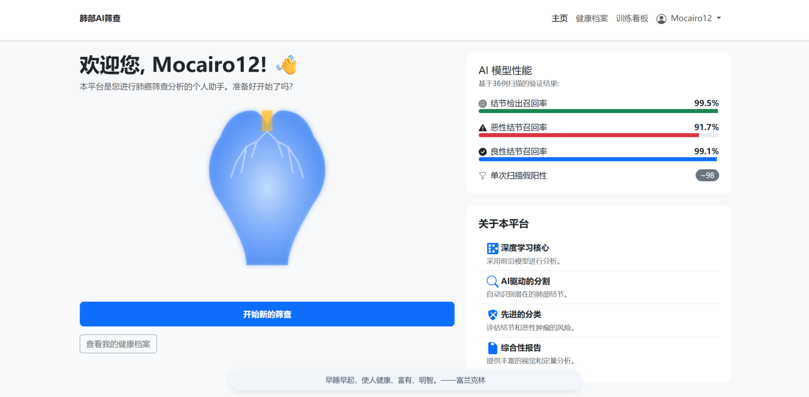
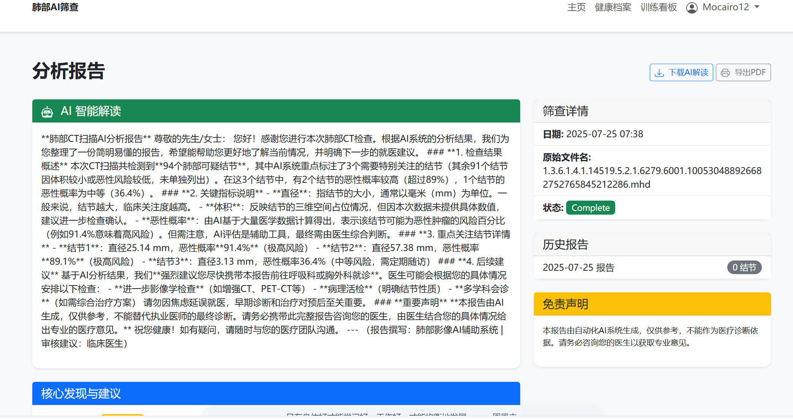
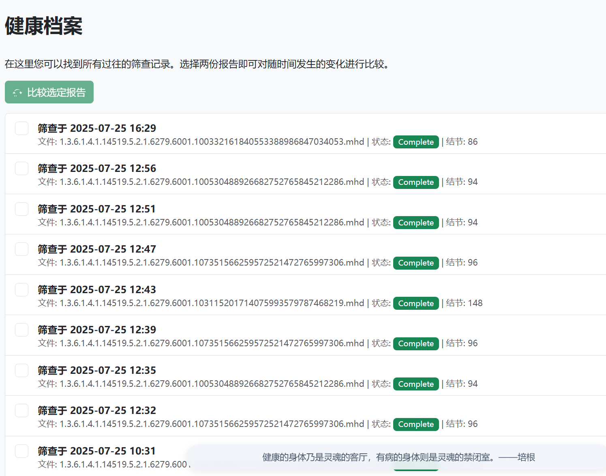
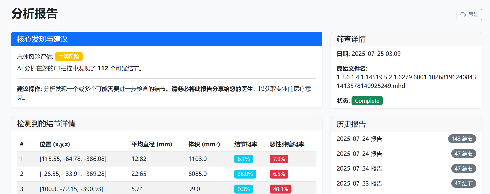
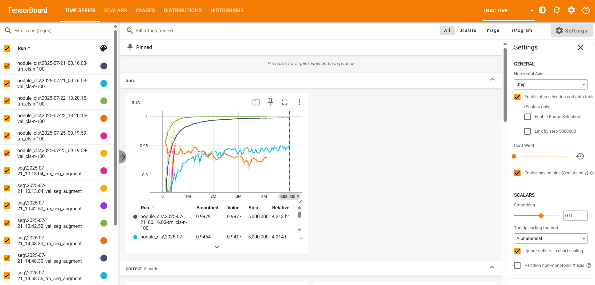

## 目录
- [项目介绍](#项目介绍)
- [运行环境](#运行环境)
- [运行指南](#运行指南)
  - [准备工作](#准备工作)
  - [模型训练](#模型训练)
  - [网页显示](#网页显示)

# 项目介绍

​	肺结节：肺中由迅速增殖的细胞组成的一团组织就是肿瘤，肿瘤可以是良性的，也可以是恶性的，在恶性的情况下，就是我们所熟知的癌症。肺部的小肿瘤（只有几毫米宽）被称为结节，在肺部影像学检查（如CT、X光等）中，肺部结节呈现类圆形、密度增高的局灶性阴影，这些结节大约有40%左右会转变恶性肿瘤，即早期癌症，所以尽早发现这些结节，对于癌症的预防和治疗非常重要。

​	本项目主要是检测CT影像中的结节以及肿瘤并进行标注分割。

​	本项目主要用于学习，不做他用！

# 运行环境

```
requirements.txt
```

# 运行指南

## 准备工作

1、数据集：LUNA 2016，下载地址：https://luna16.grand-challenge.org/Download/

2、下载前要准备200G左右的磁盘空间，其中60G用于保存数据集的压缩文件；120G用于保存解压后的数据集文件

3、数据集可以不全下载（由于电脑问题，本项目只跑了四组数据集）

**注意：本项目所使用CT影像皆为mhd以及raw文件格式！**

## 模型训练

### 结节分类模型训练

```
python TumorPrepCache.py
python TumorTraining.py
```

### 肿瘤分类模型训练

​	需要更改`TumorTraining.py`文件。

```
parser.add_argument('--dataset',
	help="指定输入模型的数据集", 
	action='store', 
	default='LunaDataset', # 用于结节分类
	# default='MalignantLunaDataset',# 用于肿瘤分类
	)
parser.add_argument('--malignant',
	help="是否将把结节分类模型训练为识别良性或恶性的模型", 
	action='store_true',
    default=True
    )
parser.add_argument('--finetune', 
	help="启动微调模型",
    default='' # 使用你训练好的模型进行微调
     # rawdata/tumor/models/nodule_cls/tumor_2025-07-21_08.37.08_100.best.state
    )
```

```
python TumorTraining.py
```

### 分割模型训练

```
python PrepCache.py
python segmentTraining.py
```

### 模型训练曲线

```
tensorbaord --logdir runs
```

​	这个可以看模型的训练情况。

<div style="display: flex; justify-content: space-around;">
  
  
</div>

### 训练好的模型

​	本模型已经训练好了这些模型

```
cd rawdata/seg/models/seg # 分割模型
cd rawdata/tumor/models/nodule_cls # 结节分类模型以及微调肿瘤分类模型
```

​	其中结节分类模型有三个包括`tumor_2025-07-21_00.16.03_n-100.best.state`、`tumor_2025-07-21_08.37.08_100.best.state`、`tumor_2025-07-26_10.07.36_n-100.best.state`

- 默认模型: `tumor_2025-07-21_08.37.08_100.best.state` (可在 `app/ai_models` 中修改)
- 推荐最佳模型: `tumor_2025-07-26_10.07.36_n-100.best.state`

## 网页显示

​	直接运行`run.py`即可。

### 效果展示











